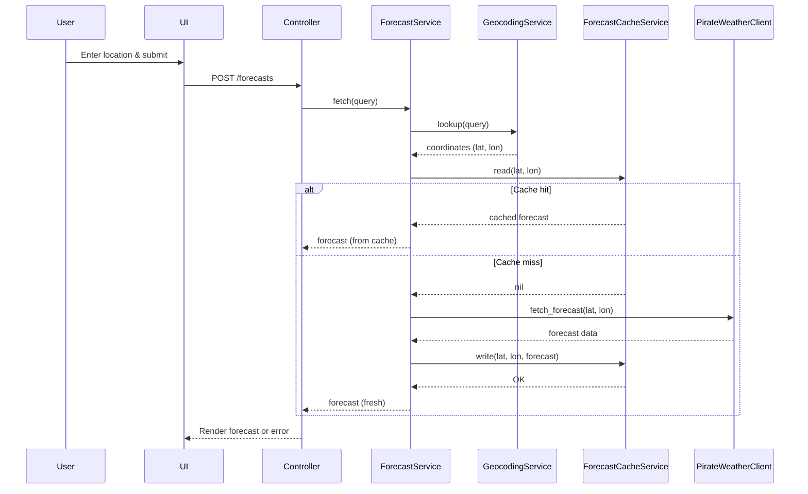

# Weather Rails App

A robust, modern Rails 8+ weather forecast application featuring:
- Clean service-oriented architecture
- Strong test isolation and dependency injection
- Secure, user-friendly error handling
- Extensible, maintainable design

---

## Table of Contents
- [Overview](#overview)
- [Key Architectural Choices](#key-architectural-choices)
- [Gem Dependencies](#gem-dependencies)
- [Configuration & Environment](#configuration--environment)
- [Running the App](#running-the-app)
- [Testing](#testing)
- [Best Practices & Noteworthy Patterns](#best-practices--noteworthy-patterns)
- [Scalability & Extensibility](#scalability--extensibility)
- [License](#license)

---

## Overview
This app provides weather forecasts for user-supplied locations, with geocoding and weather data fetched from external APIs. It is built for reliability, testability, and developer clarity, following modern Rails conventions and best practices.

---

## Screenshots

Below are example screenshots of the UI, showcasing the forecast results for various cities:


*Forecast result for Anchorage, AK*


*Forecast result for Banff, AB (Canada)*


*Forecast result for Cheyenne, WY*


*Forecast result for Phoenix, AZ*

---

## Caching Strategy

### Narrative Description
1. **User submits a location** via the UI (e.g., "Portland, OR").
2. **Controller** calls `ForecastService.fetch(query)`.
3. **ForecastService**:
   - Calls `GeocodingService.lookup(query)` to get coordinates.
   - Computes a cache key using the coordinates.
   - Checks `ForecastCacheService.read(lat, lon)`:
     - If a valid, unexpired forecast is cached, returns it immediately.
     - If not, calls `PirateWeatherClient` to fetch a fresh forecast.
   - Saves the new forecast to the cache with an expiry (`WEATHER_CACHE_EXPIRY_MINUTES`).
   - Returns the forecast and location info to the controller.
4. **Controller** renders the result or error to the user.

- **Cache Expiry**: Controlled by `WEATHER_CACHE_EXPIRY_MINUTES` in `.env`.
- **Cache Backend**: Uses Rails.cache (SolidCache by default, easily swappable for Redis in production).
- **Keying**: Cache keys are based on latitude/longitude, ensuring unique entries per location.
- **Security**: No sensitive info is ever cached or exposed.

### Sequence Diagram


---

## Key Architectural Choices
- **Service Objects**: `ForecastService`, `GeocodingService`, and `ForecastCacheService` encapsulate business logic, keeping controllers thin and views simple.
- **Dependency Injection**: External services (like Geocoder) are injected into service objects, allowing for robust, isolated tests without global stubs or HTTP requests.
- **Explicit Error Handling**: All user-facing errors are caught and displayed cleanly; no stack traces or sensitive info are ever leaked.
- **Caching**: Forecasts are cached to minimize API calls, with cache expiry controlled via environment variable (`WEATHER_CACHE_EXPIRY_MINUTES`).
- **Constants Module**: Icon mapping and similar logic are centralized in `app/constants` for maintainability.

---

## Gem Dependencies
- **rails**: Modern Rails 8+ framework
- **pg**: PostgreSQL database
- **propshaft**: Asset pipeline
- **solid_cache**: Rails.cache adapter
- **solid_queue**: ActiveJob adapter
- **bootsnap**: Fast booting
- **puma**: Web server
- **tailwindcss-rails**: CSS utility framework
- **importmap-rails**: ESM asset management
- **hotwire-rails**: Turbo/Stimulus for reactive UI
- **geocoder**: Geocoding queries
- **faraday**: HTTP client for API calls
- **rspec-rails**: Testing framework
- **capybara**, **selenium-webdriver**: Feature/system tests
- **simplecov**: Code coverage
- **vcr**, **webmock**: HTTP request stubbing (legacy, not required with DI)
- **brakeman**, **rubocop-rails-omakase**: Security and style (dev/test)

---

## Configuration & Environment
- **Geocoder**: Configured in `config/initializers/geocoder.rb` to use `Rails.cache` and prefer US results for ambiguous queries.
- **Cache Expiry**: Set via `WEATHER_CACHE_EXPIRY_MINUTES` in your `.env` file (default: 15 minutes).
- **Forecast API Key**: The Pirate Weather API key is managed securely outside of `.env` (see deployment or secrets setup).
- **Autoload Paths**: `app/constants` is autoloaded for easy access to shared constants.

---

## Running the App
1. **Install dependencies** (from WSL terminal, as required):
   ```sh
   bundle install
   ```
2. **Set up the database**:
   ```sh
   rails db:setup
   ```
3. **Configure environment variables**:
   - Copy `.env.example` to `.env` and fill in secrets (API keys, etc.).
4. **Run the server**:
   ```sh
   rails server
   ```
5. Visit [http://localhost:3000](http://localhost:3000)

---

## Testing
- **Run all specs**:
  ```sh
  bundle exec rspec
  ```
- **Coverage**: SimpleCov will generate a report in `coverage/`.
- **Test Isolation**: All external dependencies are mocked or injected. No real HTTP requests are made in tests. Geocoder is always stubbed.
- **Feature/Request Specs**: Cover all user input edge cases, error handling, and UI feedback.

---

## Best Practices & Noteworthy Patterns
- **Strict Test Isolation**: No global stubs or VCR cassettes required; all dependencies are injected or mocked at the spec level.
- **Service-Oriented**: Business logic is never in controllers or views.
- **Centralized Constants**: All icon mappings and similar logic are in a single location.
- **Security**: No sensitive info is ever leaked. Brakeman is included for static analysis.
- **Accessibility**: UI is designed to be accessible and clear for all users.
- **Scalable Caching**: Easily switch to Redis for production by changing Rails.cache backend.

---

## Scalability & Extensibility
- **Caching**: Minimizes API calls and improves performance.
- **Service decomposition**: Makes the app easy to maintain and extend (e.g., add user accounts, favorites, etc.).
- **Easily extensible**: Add new features or swap out APIs with minimal code changes.

---

## License
MIT
